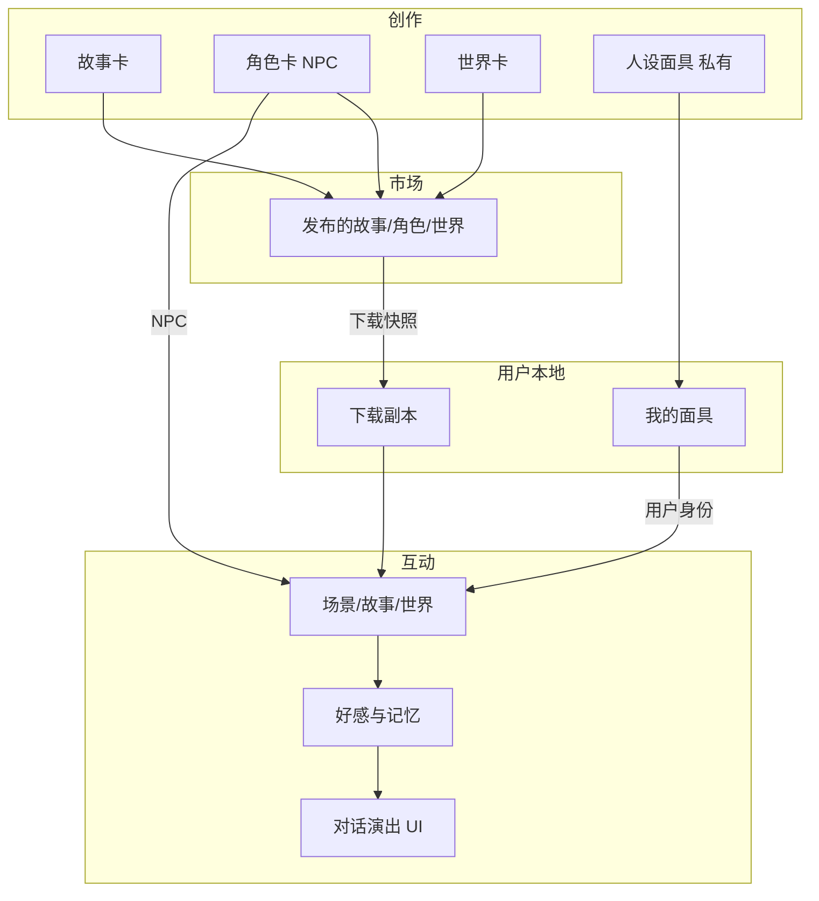

# StoryForge 整改方案（产品 + 领域模型）

> 状态：方案文档（尚未落地代码）  
> 日期：2026-07-30  
> 背景：角色卡设定偏薄、对话身份与 NPC 未分离、市场仅为可见性而非下载副本、产品感偏「聊天 AI 工具」。

基于现状，按以下诉求给出整改方向，并说明它们如何互相咬合。

1. 丰富角色卡设定（含美化、好感度等特色）
2. 补充人设面具（用户扮演身份，不可上架）
3. 市场下载模型与作者/用户权益约束
4. 从「聊天 AI 工具」转向「角色互动平台」
5. **开场语**：角色卡 / 世界卡 / 故事卡对话由系统角色先发；创作与更新时提供开场语输入

---

## 一、目标定位（先定调）

从 **「用对话写小说的 AI 工具」** 调整为：

> **角色互动平台**：用户用「人设面具」进入场景；角色卡是可互动的 NPC；故事/世界是舞台；好感与关系会随互动生长；市场内容下载到本地后与作者再编辑解耦。

创作与导出能力保留，但主路径体验应是「选身份 → 进场景 → 与角色建立关系」，而不是「打开空白聊天框」。

| 概念 | 新定位 | 可否上市场 |
|------|--------|------------|
| **角色卡** | 故事/世界中的 NPC（可独立对话） | ✅ |
| **人设面具** | 用户自己扮演的身份 | ❌ 仅私有 |
| **世界卡** | 舞台与知识约束 | ✅ |
| **故事卡** | 带大纲/关系的可体验剧本 | ✅ |

---

## 二、问题 1：丰富角色卡 + 特色（美化 / 好感度）

### 2.1 角色卡内容分层

建议拆成 **基础设定** + **互动设定** + **关系成长**，避免一次性做成 SillyTavern 全量克隆。

**A. 基础人设（创作必填/选填）**

| 字段组 | 内容 | 作用 |
|--------|------|------|
| 外观 | 外貌、穿着、气质、声线描述 | 生成开场与描写一致性 |
| 身份背景 | 年龄段、身份、出身、秘密 | 剧情锚点 |
| 性格行为 | 性格、说话风格、禁忌、口头禅、示例对白 | 防 OOC |
| 关系倾向 | 对陌生人/熟人的默认态度、喜好/雷点 | 好感系统起点 |
| 开场语 | 作者设定的首条系统发言（见下节） | 进入对话后系统先发，建立场景感 |

**B. 互动增强（平台特色）**

1. **好感度系统（建议作为核心特色）**
   - 维度：综合好感 0–100；可选子维（信任 / 亲密 / 敬意），MVP 可先做单维。
   - 状态档：陌生 → 认识 → 友好 → 信赖 → 羁绊（名称可配置）。
   - 驱动：对话行为标签（关心、送礼式选择、冲突、越界）→ 增减；作者可配「关键事件阈值」。
   - 效果：解锁台词风格、秘密、特殊结局分支、UI 状态条与里程碑提示。
   - 存储：按 `(user_id, character_id 或 download_instance_id, session/playthrough)`，与聊天历史绑定，可跨会话保留。

2. **美化 / 表现层（不只是填表）**
   - 角色详情：氛围封面、标签色、气质文案、好感阶段视觉变化。
   - 对话页：角色立绘/头像区 + 好感条 + 当前关系文案（弱化「IM 聊天」感）。
   - 可选后续：简单表情/姿态状态机（平静 / 微笑 / 警惕），由模型或规则输出状态码驱动 UI。

3. **记忆与印象（轻量）**
   - 「角色对用户的印象摘要」定期由模型压缩写入，注入后续 prompt。
   - 与好感联动：高好感解锁更深记忆槽。

### 2.2 与现有创作流的衔接

- `/compose` 及各类卡编辑页：角色表单升级为分步（基础 → 性格 → **开场语** → 好感规则）；世界卡、故事卡的创建/编辑同步增加 **开场语** 输入框（详见「二补充」）。
- 详情页：预览「用户视角卡片」+「作者编辑」，并提供「试聊」验证系统先发开场语与好感 UI。
- 故事引入角色后：角色仍是 NPC；关系图谱可与好感初始态度联动（后续迭代）。

### 2.3 分期建议

| 期次 | 内容 |
|------|------|
| **P0** | 字段扩充 + **开场语** + 对话页角色氛围 UI |
| **P1** | 单维好感 + 档位文案 + prompt 注入 |
| **P2** | 多维好感、关键事件、表情状态、印象记忆 |

---

## 二补充、开场语与「系统先发」（角色卡 / 世界卡 / 故事卡）

### 规则（产品硬约束）

与 **角色卡、世界卡、故事卡** 开启的对话中：

- **第一条消息必须由系统侧先发出**（角色 / 世界旁白 / 故事叙事者），**不允许**进入会话后出现空白输入框等用户先开口。
- 用户看到开场语后，再开始回复；此为首屏「相遇」体验，直接支撑「角色互动平台」而非「聊天工具」的心智。

人设面具本身不提供「对用户说的开场语」（面具是用户身份，不是被对话对象）。

### 创作 / 更新：开场语输入框

在三类卡的 **创建** 与 **编辑更新** 表单中，均新增 **「开场语」** 多行输入框，用于设置进入对话后的首条系统发言。

| 卡类型 | 开场语语义（建议文案提示） | 对话中呈现为 |
|--------|---------------------------|--------------|
| **角色卡** | 角色见到用户时的第一句话 / 第一幕描写 | 该角色（assistant）发言 |
| **世界卡** | 踏入世界时的环境描写、引导或旁白 | 世界旁白 / 系统叙事 |
| **故事卡** | 故事开场：场景、冲突引入或旁白 | 故事叙事者 / 系统开场 |

字段建议：

- 存储名：`greeting` 或 `opening_line`（三类卡各自表/草稿 JSON 均可）
- 必填策略：建议 **发布到市场前必填**；本地草稿可暂空，但「开始对话 / 体验」时若为空则拦截并提示补全，或使用平台兜底模板（不推荐长期依赖兜底）
- 长度：建议上限（如 500～2000 字），与现有 XSS / 长度校验一致
- 下载快照：开场语随卡一起进入用户本地副本；作者改市场稿不影响已下载版本的开场语

### 会话创建时的行为

1. 用户进入角色对话 / 世界探索 / 故事体验并完成身份选择（如需面具）后，**创建会话**。
2. 服务端（或创建会话接口）读取对应卡的开场语，写入会话消息列表的 **第一条**：`role = assistant`（或明确的 `system_opening` 展示角色，UI 上仍显示为角色/世界/故事侧气泡）。
3. 前端进入聊天页时直接渲染该条，输入框可用，但历史中已有系统先发内容。
4. **不**为开场语再调一次大模型生成（除非作者未填且产品明确允许「AI 补开场」——本方案默认 **只用作者填写的开场语**）。

### 与现有「开场 / 氛围 UI」的关系

- 第二节角色卡「开场」能力，统一落实为本字段 + 系统先发，避免「有文案但对话仍是用户先说」。
- 第五节「开场演出」以本开场语为最小实现；后续可再叠加立绘、好感条动画等。

---

## 三、问题 2：人设面具（用户身份）

### 3.1 产品定义

**人设面具** = 用户在对话中的「我是谁」，字段深度对齐角色卡（外观 / 性格 / 背景 / 说话方式 / 与他人的默认关系），但：

- 只能在「创作」创建与编辑；
- **禁止发布、禁止出现在市场**；
- 「我的」新增「我的人设面具」列表（详情 / 编辑 / 删除）。

### 3.2 三类对话的身份规则

```
故事对话：角色卡 = 全部 NPC；用户必须/默认选「人设面具」作为「我」
角色对话：可选人设面具；也可不选，以匿名「用户」直接聊
世界对话：可选人设面具；也可不选，以探索者身份进入
```

| 场景 | 用户身份 | 角色卡角色 |
|------|----------|------------|
| 故事体验 | **人设面具**（进入前必选或创建） | 全部为 NPC，不再「选角色卡来扮演」 |
| 角色卡对话 | 可选面具 / 可不选 | 对方就是该角色卡 |
| 世界卡对话 | 可选面具 / 可不选 | 世界内 NPC 由设定/引入决定 |

### 3.3 与旧「故事选角色扮演」的迁移

- **废弃**：体验前「从引入角色卡中选一个来扮演」。
- **改为**：体验前「选择/新建人设面具」→ 进入故事；引入的角色卡全部作为可对话/可出场的 NPC。
- 会话模型建议：`persona_mask_id`（可空）+ `session_type`；故事会话强制非空（或引导创建默认面具）。
- Prompt：明确 `User Persona` vs `NPC Characters`，避免模型把用户写成某个引入角色。

### 3.4 「我的」信息架构调整

```
我的
├── 通知
├── 收藏
├── 我的故事
├── 我的角色卡      ← NPC 作品
├── 我的世界
├── 我的人设面具    ← 新增，不上架
└── （后续）我的下载库  ← 见问题 3
```

创作页 Tab：`故事 | 角色 | 世界 | 人设面具`。

### 3.5 边界

- 面具不可被他人「引入故事」为公共资产；作者故事里的自定义路人仍用「故事内临时角色 / 角色卡」，与面具分离。
- 删除面具：若有进行中会话，需提示「历史会话保留快照文案，但新会话不可再选」或软删除。

---

## 四、问题 3：市场上架约束与「下载到本地」

### 4.1 核心原则

> **市场行为 = 下载副本，不是在线引用。**  
> 下载后内容进入用户本地库；作者下架/修改 **不影响** 已下载版本。  
> 后续可用积分扣费；MVP 可先「免费下载 + 预留积分字段」。

这同时保护：

- **用户**：已下载可继续玩、继续引入自己的故事。
- **作者**：下架即停止新下载；更新是发「新版本」，不静默覆盖他人本地副本。

### 4.2 推荐领域模型

```
市场作品（作者侧，可发布/下架/更新版本）
        │ 下载
        ▼
用户本地副本（owned_copy：内容快照 + source_work_id + source_version + downloaded_at）
        │
        ├── 可对话 / 可引入自己的故事
        └── 与作者线上最新版无关
```

- **引入故事**：从「我创建的 + 我下载的」选，写入故事时再快照或挂 `local_copy_id`（避免作者改市场稿影响已组故事）。
- **收藏**：仍可保留为「想下/想看」；与「已下载」分开。

### 4.3 作者权益与操作约束

| 操作 | 约束建议 |
|------|----------|
| 发布 | 审核/扫描通过；生成 `version` |
| 下架 | 市场不可见、不可再下载；**已下载副本保留** |
| 修改并同步市场 | 升版本；已下载用户可选「检查更新 / 忽略」 |
| 删除 | 须先下架。**已下载到用户本地的副本不受影响**（下载即快照）；删除母本仅停止新下载与市场展示，不回收用户本地卡 |
| 被故事引用（作者自己的） | 下架前检查；或仅允许下架市场、本地创作链仍在 |

**作者权益展示**：副本带「来源作者、原作 ID、下载版本、许可声明（如仅可私人使用 / 可二创需标注）」。

**用户权益**：本地副本可玩、可改私有衍生（改的是自己的 fork，不回写作者市场稿）；不可再上架「原作拷贝」冒充原创（上架前查 `source_work_id` + 相似度/声明）。

### 4.4 积分（预留）

- 作品标价 `download_cost`（0 = 免费）。
- 下载流水：`user_id, work_id, version, cost, created_at`。
- 同一用户同一版本不重复扣费；新大版本可配置是否再收费。

### 4.5 与「人设面具」的关系

面具永不进下载/市场；下载库只有故事 / 角色 / 世界。

### 4.6 分期

| 期次 | 内容 |
|------|------|
| **P0** | 下载 = 生成本地快照；下架不影响本地；「我的下载」入口 |
| **P1** | 版本号 + 可选更新提示 |
| **P2** | 积分扣费 + 许可协议文案 + 防原作再上架 |

---

## 五、问题 4：从「聊天 AI」变成「角色互动平台」

单靠加字段不够，要改 **主路径叙事与界面语义**。

### 5.1 体验主路径（建议默认心智）

```
市场发现 → 下载故事/角色/世界 → 选人设面具 → 进入场景
     → 看开场演出 / 好感 → 互动推进 → 里程碑 / 回忆 / 再续
```

创作路径仍在，但首页与空状态文案应强调「相遇与关系」，而不是「开始对话」。

### 5.2 产品层改造清单

1. **对话不再是裸 IM**
   - 场景标题、章节/地点、角色出场条、好感条、面具身份条。
   - **系统先发开场语**（角色 / 世界 / 故事作者在创作时填写），进入后不是空输入框等用户先说。

2. **身份始终可见**
   - 顶栏：「你正在以【面具名】行动」；故事中 NPC 列表可点「与 TA 互动」。

3. **关系成长可见**
   - 好感变化 toast / 阶段解锁；历史里可看「关系轨迹」（轻量即可）。

4. **会话有「剧本感」**
   - 故事：按章节或场景进入；世界：地点/条目入口；角色：约会式场景预设（后续）。

5. **减少工具感文案**
   - 「生成」「模型」「提示词」对 C 端弱化；创作者设置里保留高级项。

6. **修复现有体验缺口（与互动平台强相关）**
   - 非作者体验故事时也能拿到引入角色列表（基于下载副本或公开包）。
   - 故事会话绑定世界，使世界观与 RAG 生效。

### 5.3 「互动平台」最小闭环（本阶段成功标准）

用户可以：下载一张角色卡 → 用人设面具开聊 → 看到开场与好感变化 → 在「我的」管理面具与下载库 → 作者下架后自己仍能继续玩本地版。

达到这点，产品叙事就从工具切到平台。

---

## 六、四者如何咬合（总架构）



---

## 七、推荐落地顺序（避免一次做爆）

### 阶段 A — 身份模型纠偏（优先，改认知）

1. 新人设面具 CRUD（创作 + 我的，不上架）
2. 三类对话接入面具规则（故事必选；角色/世界可选）
3. 去掉「用角色卡扮演」；角色卡统一 NPC

### 阶段 B — 角色互动特色 + 开场语

4. 角色卡 / 世界卡 / 故事卡：创作与更新增加 **开场语** 输入；三类对话会话创建时 **系统先发** 该开场语
5. 角色卡其余字段扩充、对话氛围 UI
6. 好感度 P0（单维 + 档位 + 注入）

### 阶段 C — 市场下载与权益

7. 下载快照 + 我的下载库（快照含开场语）
8. 下架/删除策略与版本字段
9. 故事引入改为「本地创建 + 本地下载」

### 阶段 D — 平台感打磨

10. 开场演出增强（立绘/动画等）、关系轨迹、文案与信息架构
11. 积分与更新提示（可更晚）

---

## 八、关键决策（已确认 · 2026-07-30）

1. **故事体验 · 人设面具**：**强制选择**。进入故事体验前必须选定人设面具，不可跳过、不提供系统默认面具代选。
2. **好感范围**：
   - **角色卡对话**：必须展示好感度（UI + 持久化）。
   - **故事体验**：对故事中 **每个 NPC 分别记账**（按用户 × 故事上下文 × 角色卡分别存好感）。
3. **下载后的编辑与上架**：**可私有编辑**本地副本；若再次上架，**必须声明衍生**，或 **禁止上架未授权拷贝**（无授权/未声明衍生则不可发布）。
4. **作者删除**：市场下载已是用户本地快照，**作者删除母本不影响**已下载到对应用户本地的卡；删除前仍建议先下架，删除后停止新下载即可。
5. **积分**：市场 **UI 显示免费**；积分字段与流水 **仅预留、本阶段不实现扣费**。

---

## 九、小结

| 诉求 | 方案要点 |
|------|----------|
| 角色卡太简单 | 分层设定 + 开场语 + **好感度** + 对话美化，形成互动特色 |
| 人设面具 | 私有身份资产；故事用面具进场，角色卡全是 NPC；角色/世界对话可选面具 |
| 作者/用户权益 | 市场改为 **下载快照**；下架与修改不动本地；删除受限；积分后置 |
| 不像互动平台 | 改主路径与对话 UI：身份、场景、关系成长，弱化纯聊天工具感 |
| **开场语 / 系统先发** | 角色卡、世界卡、故事卡创作与更新均可设开场语；进入对话后 **系统角色先说第一句**，用户再回复 |

---

## 十、后续文档动作建议

1. ~~拍板第八节关键决策后，将结论回写本节并标注「已确认」。~~ **已完成（2026-07-30）**
2. 阶段 A–C 核心能力已开始落地代码（人设面具 / 开场语系统先发 / 好感度 / 下载快照 / 衍生上架约束）；请同步核对 `openapi.yaml` 与走查列表。
3. 落地验证后更新 `走查列表.md`，补充人设面具、下载库、好感度、以及「三类卡开场语 + 系统先发」相关走查项。
